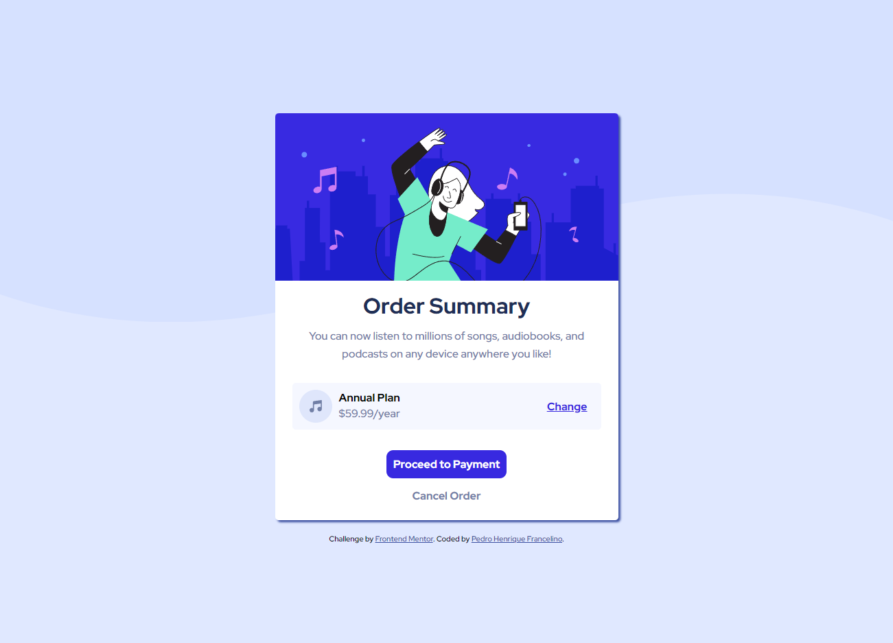

# Frontend Mentor - Order summary card

This is a solution to the [Order summary card challenge on Frontend Mentor](https://www.frontendmentor.io/challenges/order-summary-component-QlPmajDUj). Frontend Mentor challenges help you improve your coding skills by building realistic projects. 

## Table of contents

- [Overview](#overview)
  - [The challenge](#the-challenge)
  - [Screenshot](#screenshot)
  - [Links](#links)
- [My process](#my-process)
  - [Built with](#built-with)
  - [What I learned](#what-i-learned)
  - [Continued development](#continued-development)
  - [Useful resources](#useful-resources)
- [Author](#author)


## Overview

### The challenge

Users should be able to:

- See hover states for interactive elements

### Screenshot



### Links

- Solution URL: [Add solution URL here](https://your-solution-url.com)
- Live Site URL: [Add live site URL here](https://your-live-site-url.com)

## My process

### Built with

- Semantic HTML5 markup
- CSS custom properties
- Flexbox
- Mobile-first workflow

### What I learned

I learned more about responsive design and how to use HTML tags correctly. The best way to build HTML code and organize CSS style using class and pseudo class. I practiced also flexbox concepts in order to build this challenge.


```html
<div class="pricing">
    <article>
      
      <div>
        <h4>Annual Plan</h4> 
        <p>$59.99/year</p>
      </div>
    </article>
    <button class='btn btn-change'>Change</button>
</div>
```
```css
body{
    font-family: 'Red Hat Display', sans-serif;
    background-color: var(--pale-blue); 
    text-align: center;
    display: flex;
    flex-direction: column;
    align-items: center;
    justify-content: center;
    min-height: 100vh;
}
```

### Continued development

I will continue to study and practice flexbox concepts, including grid box, as well as best practices for building responsive pages, using Sass to create projects and improve my frontend skills.

## Author

- Frontend Mentor - [@peterhfss](https://www.frontendmentor.io/profile/peterhfss)
- Twitter - [@Peterhfss](https://www.twitter.com/Peterhfss)


